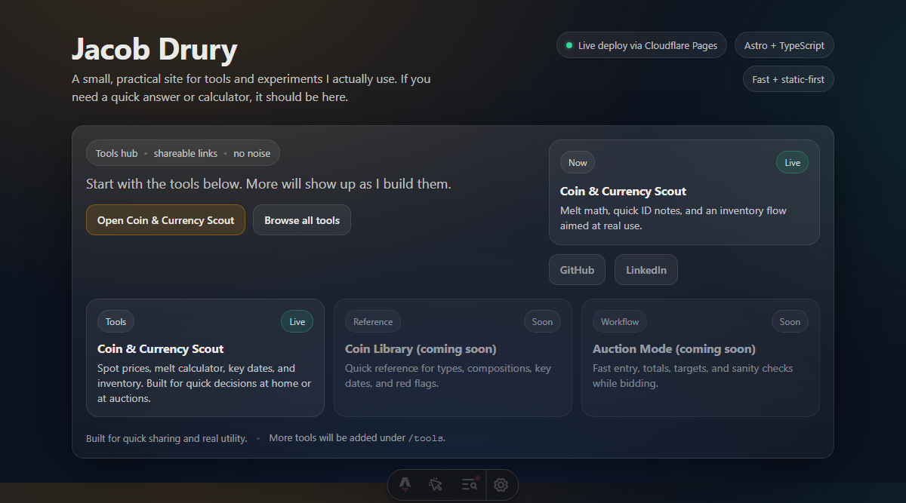

# Jacob's Site

Personal website and small toolkit collection. Built with Astro and React, the site hosts interactive utilities (notably the CoinScout tool), projects, and a simple profile.


[](https://jacobd-site.pages.dev) [](https://astro.build) [](LICENSE)



Quick link: Live demo — https://jacobd-site.pages.dev

**Table of contents**

- [About](#about)
- [Live demo](#live-demo)
- [Features](#features)
- [Quick start](#quick-start)
- [Project structure](#project-structure)
- [Tech stack](#tech-stack)
- [Contributing](#contributing)
- [License & contact](#license--contact)

## About

This repository contains the source for my personal site. It includes small web tools (see `CoinScout`), a projects list, and personal notes. The site is deployed to GitHub Pages and serves static assets from `public/`.

## Live demo

View the live site: https://jacobd-site.pages.dev

## Features

- **CoinScout**: Interactive coin research tool — lookup coin types, key dates, varieties, and grading guidance.
- **Tools collection**: Tiny utilities and demos under `src/pages/tools/`.
- **Fast static site**: Built with Astro for performant static builds and partial hydration via React components.

Example: open the CoinScout tool at `/tools/coin-scout` to search and explore coin details.

## Quick start

Prerequisites: Node.js (16+ recommended) and npm or pnpm.

Install and run locally:

```bash
npm install
npm run dev
```

Build for production:

```bash
npm run build
npm run preview
```

## Project structure

```text
/
├── public/                # static assets (favicons, images, manifest)
├── src/
│   ├── assets/
│   ├── components/        # React components (CoinScout.jsx)
│   ├── layouts/           # Astro layouts
│   ├── pages/             # Astro pages and API routes
│   │   └── tools/         # interactive tools (coin-scout)
│   └── styles/            # global styles
└── package.json
```

## Tech stack

- Astro — static site generator
- React — interactive components
- Tailwind CSS — utility-first styling
- Lucide React — icons

## Contributing

Suggestions, fixes, or issues are welcome. Please open an issue or a PR with a short description of the change.

If you'd like to run and test locally, follow the Quick start above and check the `tools/` pages.

## License & contact

This project is available under the MIT License. For questions or collaboration, open an issue or contact the repository owner.