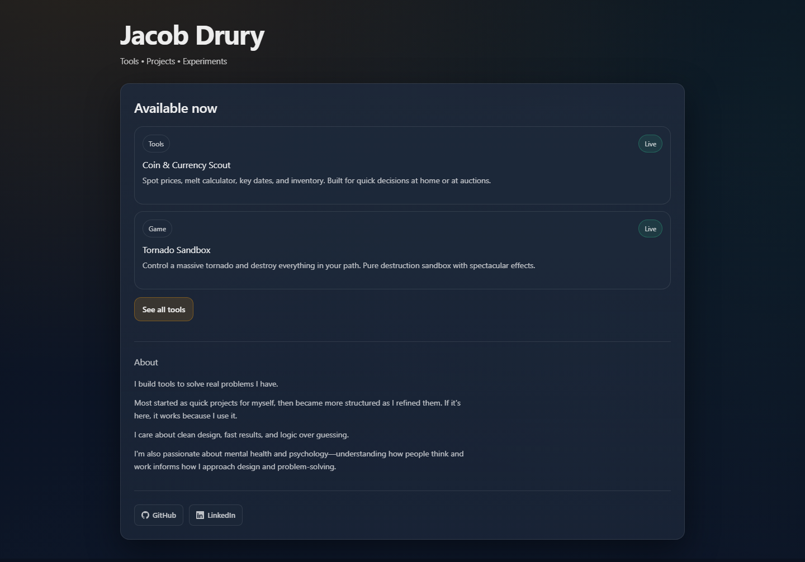
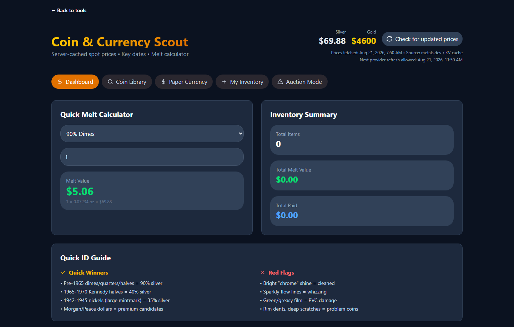
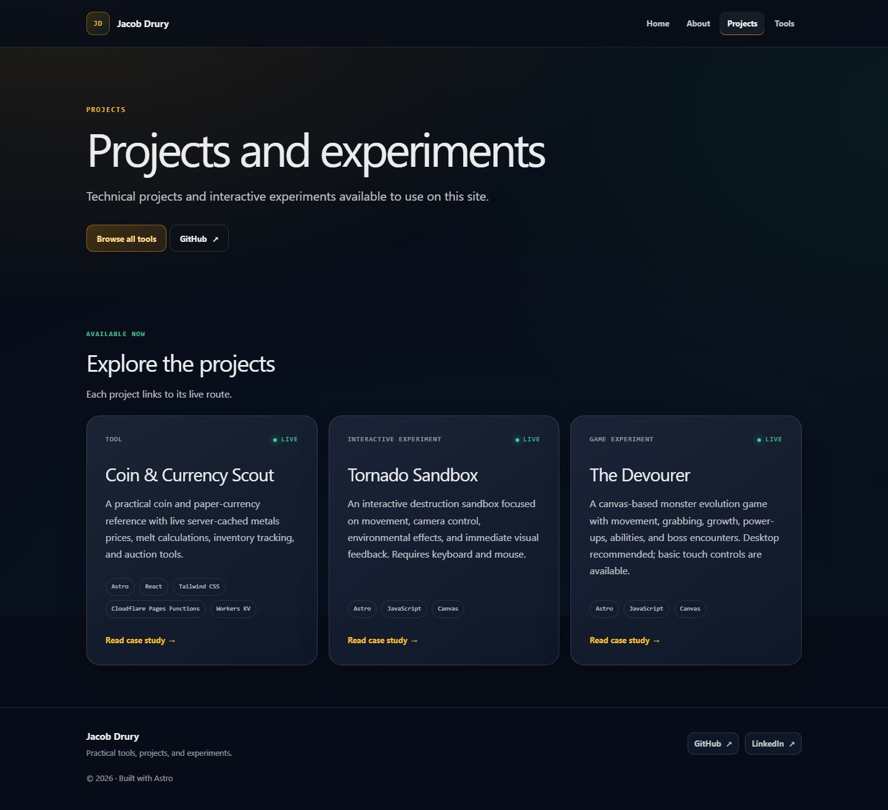

# Jacob Drury Tools + Projects Hub

An Astro-based hub for useful tools, projects, games, and experiments. This repository powers [jacobd-site.pages.dev](https://jacobd-site.pages.dev).

This is not the complete `jacobd.us` personal site. `jacobd.us` currently points to a separate minimal Google Sites page; any future domain or subdomain integration remains undecided.

## Screenshots

### Hub homepage

[](https://jacobd-site.pages.dev/)

*The production hub highlighting currently available tools and experiments.*

### Coin & Currency Scout

[](https://jacobd-site.pages.dev/tools/coin-scout/)

*The Coin Scout dashboard using the deployed KV-backed metals snapshot.*

### Projects

[](https://jacobd-site.pages.dev/projects/)

*The project directory connecting each case study to its live tool or experiment.*

## What is here

- **Coin & Currency Scout** — server-cached metals prices, melt calculators, coin and paper-currency references, local inventory tracking, and auction calculations.
- **Tornado Sandbox** — an interactive 3D destruction experiment.
- **The Devourer** — a canvas-based monster evolution game.
- **Project pages** — lightweight case studies for each live project with direct launch links.
- **Hub pages** — a focused home page, tools directory, brief About section, and custom 404 page.

## Routes

| Route | Purpose |
| --- | --- |
| `/` | Tools, projects, experiments, and brief About content |
| `/projects/` | Project directory and case-study links |
| `/projects/coin-scout/` | Coin & Currency Scout project page |
| `/projects/tornado-sandbox/` | Tornado Sandbox project page |
| `/projects/the-devourer/` | The Devourer project page |
| `/tools/` | Directory of live tools and games |
| `/tools/coin-scout/` | Coin & Currency Scout |
| `/tools/tornado-3d/` | Tornado Sandbox |
| `/tools/monster-game/` | The Devourer |
| `/api/metals.json` | Cloudflare Pages Function serving a KV-backed metals-price snapshot |

## Stack and deployment

- [Astro](https://astro.build) for static pages and routing
- React for Coin Scout's interactive interface
- Tailwind CSS for utility styling
- Playwright for README and one-off browser screenshots
- GitHub repository: `JacobDrivers/jacobd-site`
- Production branch: `master`
- Cloudflare Pages build command: `npm run build`
- Cloudflare Pages output directory: `dist`
- Cloudflare Pages Function: `functions/api/metals.json.js`

Cloudflare Pages automatically builds and deploys the repository after changes are pushed to the production branch.

## Local development

Use a current Node.js LTS release and npm.

```bash
npm install
npm run dev
```

Astro prints the local development URL after startup.

Create a production build with:

```bash
npm run build
```

Preview the generated `dist` output locally with:

```bash
npm run preview
```

## Metals price cache

The Astro site remains static. The targeted route `/api/metals.json` is handled by a Cloudflare Pages Function, and `public/_routes.json` prevents Functions from being invoked for unrelated site routes.

The Function keeps the authoritative price snapshot in Workers KV. A normal page load reads that snapshot without contacting a price provider. If the cache is empty, the Function initializes it once. The Coin Scout action requests a refresh check with `?refresh=1`, but the server contacts a provider only when the stored snapshot is at least four hours old.

Provider failures start a 60-minute retry cooldown. Existing KV data is returned before the shared built-in fallback, and snapshots older than 24 hours carry a prominent warning. KV locking reduces duplicate refreshes, although Workers KV is eventually consistent, so approximately 180–186 monthly provider calls is a design target rather than a strict ceiling.

The runtime requires these Cloudflare bindings:

```text
METALS_API_KEY
METALS_CACHE
```

`METALS_API_KEY` is an encrypted runtime secret for the primary Metals.dev provider. `METALS_CACHE` is a Workers KV namespace binding. If the primary provider is unavailable, the Function tries the existing Metals.live backup before returning stale KV data or the shared fallback values.

For local Pages Function development, create an untracked `.dev.vars` file containing the secret:

```text
METALS_API_KEY=your_key_here
```

Run the built site and Function with Wrangler. This command creates a local KV binding named `METALS_CACHE`; Wrangler uses local KV storage by default:

```bash
npm run build
npm exec wrangler pages dev dist --kv=METALS_CACHE
```

With the Wrangler server running, use the smoke check to verify every public route and both normal and refresh API responses:

```bash
npm run smoke -- http://127.0.0.1:8788
```

The Astro development server alone does not execute the `functions/` directory.

Never commit `.env`, `.dev.vars`, or API key files. Browser `localStorage` is used only to display the last response while the server is unavailable; it is not the authoritative cache.

## Project structure

```text
public/                 Static icons, manifest, social image, robots, and sitemap
docs/screenshots/       Browser-rendered README screenshots
functions/              Cloudflare Pages Functions
scripts/                Local screenshot helpers
src/components/         Interactive React components
src/data/               Shared site and metals data
src/layouts/            Shared Astro document layout and metadata
src/pages/              Static hub pages, tools, and games
src/styles/             Global styles and design tokens
```

## Useful commands

```bash
npm run dev
npm run build
npm run preview
npm run screenshot
npm run screenshot:readme
npm run smoke -- http://127.0.0.1:8788
```
